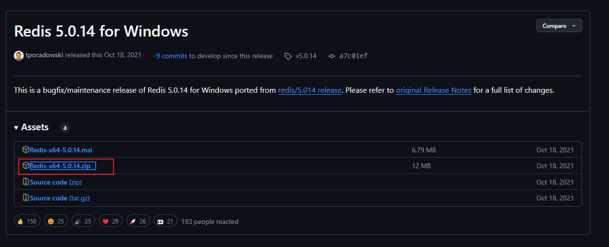
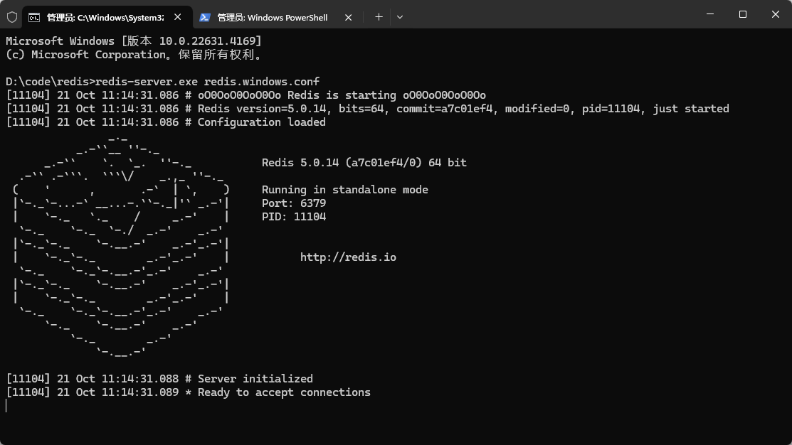
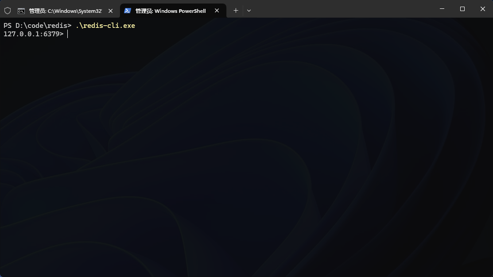

## 安装

github 地址 [https://github.com/tporadowski/redis/releases](https://github.com/tporadowski/redis/releases?spm=a2c6h.13046898.publish-article.6.2cd76ffahTMgDv)



解压压缩包即可

## 启动

### 运行服务器

在 redis 目录下执行以下命令

```bash
redis-server.exe redis.windows.conf
```



### 运行客户端

```bash
redis-cli.exe
```



### 关闭服务

1. 在 redis-cli 客户端命令行输入<code>shutdown</code>即可,退出客户端用<code>ctrl + c</code>

2. 在 redis 目录直接输入<code>./redis-cli.exe shutdown</code>,就是不进入客户端直接关闭是第一种的简便形式
3. 最方便直接在 redis 服务启动的终端直接<code>ctrl + c</code>

4. 通过 net 这种方式，这种需要将 redis 注册到 windows 服务里去，通过 net 去操作 redis 的启动或者关闭
