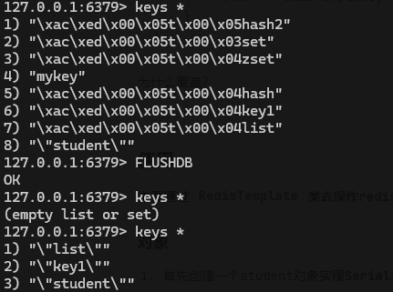

## 说明

- 此笔记为 springboot + maven 整合各种第三方依赖的使用与说明以防忘记

> springboot 版本 2.7.14

所有 maven 项目需先引入这个依赖

```xml
    <parent>
        <groupId>org.springframework.boot</groupId>
        <artifactId>spring-boot-starter-parent</artifactId>
        <version>2.7.14</version>
        <relativePath/>
    </parent>
```

此外还用到了别的依赖比如 lombok springmvc 等

## Redis

### 引入依赖

```xml
<dependency>
    <groupId>org.springframework.boot</groupId>
    <artifactId>spring-boot-starter-data-redis</artifactId>
</dependency>
```

### 配置文件

```yaml
spring:
  redis:
    database: 0
    host: localhost
    port: 6379
```

#### 覆盖 redis 原来的序列化器

```java
@Configuration
public class RedisConfig {


    @Bean
    public RedisTemplate<String, Object>redisTemplate(RedisConnectionFactory factory){
        RedisTemplate<String, Object> redisTemplate = new RedisTemplate<>();
        redisTemplate.setConnectionFactory(factory);
        // 覆盖原来的序列化器 key用String存 value用Json存
        redisTemplate.setKeySerializer(new StringRedisSerializer());
        redisTemplate.setValueSerializer(new Jackson2JsonRedisSerializer<>(Object.class));
        return  redisTemplate;
    }
}
```

为什么覆盖？

<!--  -->

在 Spring Boot 中配置 `RedisTemplate` 并覆盖默认的序列化器（如你在代码中所示），有以下几个好处：

1. **自定义键的序列化方式**：默认情况下，Redis 使用 `JdkSerializationRedisSerializer` 序列化对象。这种序列化器虽然功能强大，但它生成的序列化数据是二进制格式，不便于阅读。而使用 `Jackson2JsonRedisSerializer` 将对象序列化为 JSON 格式，使得 Redis 中的数据更加可读，尤其在调试和开发过程中，方便查看 Redis 中存储的数据内容。
2. **提升性能**：JSON 格式通常比 Java 序列化格式（JDK 序列化）占用更少的存储空间。在某些场景下，这可以提升 Redis 操作的效率，特别是当 Redis 用作缓存时，序列化与反序列化的开销可能显著影响性能。
3. **跨语言的兼容性**：由于 JSON 是一种跨语言的格式，如果你的系统与其他语言（例如 Python、JavaScript 等）进行交互，使用 JSON 序列化的 Redis 数据可以被其他语言轻松解析和读取。
4. **简化对象管理**：使用 `Jackson2JsonRedisSerializer` 时，可以直接将对象序列化为 JSON，而不需要手动编写序列化逻辑，并且 Jackson 本身支持许多高级功能，如自定义序列化规则、忽略字段等，极大地简化了对象的管理和转换工作。

简而言之，覆盖原来的序列化器使用 `Jackson2JsonRedisSerializer` 可以提升 Redis 存储的可读性、跨语言兼容性，并在某些场景下提供更好的性能。

### 使用

**主要通过<code>RedisTemplate</code>类去操作 redis**

#### 对象

1. 首先创建一个 student 对象**实现 Serializable 接口**

- Serializable 是关于序列化的接口，即将 java 对象序列化为一种格式存储到其他地方，再将这种格式拿到的时候还是能知道里边是什么

- 不实现就会报错

```JAVA
@Data
public class Student implements Serializable {
    private Integer id;
    private String name;
    private Integer age;

}
```

2. crud 操作

```java
@Autowired
private RedisTemplate redisTemplate;

@PostMapping("/setStudent")
public void setObject(@RequestBody Student student){
   redisTemplate.opsForValue().set("student", student);
}
@GetMapping("/getStudent")
public Student getObject(){
   return (Student) redisTemplate.opsForValue().get("student");
}
@DeleteMapping("/delStudent")
public boolean delObject(){
   redisTemplate.delete("student");
   return Boolean.TRUE.equals(redisTemplate.hasKey("student"));
}
```

#### 字符串

```java
@GetMapping("/setString")
public String setString(@RequestParam String key, @RequestParam String value){
    redisTemplate.opsForValue().set(key, value);
    return redisTemplate.opsForValue().get(key).toString();
}
```

#### 列表

```java
@GetMapping("/setList")
public List<String> setList(){
    ListOperations listOperations = redisTemplate.opsForList();
    listOperations.leftPush("list", "1");
    listOperations.leftPush("list", "2");
    List list = listOperations.range("list", 0, 1);
    return list;
}
```

#### 集合

```java
@GetMapping("/setSet")
public Set<String> setSet(){
    redisTemplate.opsForSet().add("set", "1");
    redisTemplate.opsForSet().add("set", "2");
    redisTemplate.opsForSet().add("set", "2");
   return redisTemplate.opsForSet().members("set");
}
```

#### 有序集合

```java
@GetMapping("/setZSet")
public Set<String> setZSet(){
    redisTemplate.opsForZSet().add("zset", "1", 2);
    redisTemplate.opsForZSet().add("zset", "2", 1);
    return redisTemplate.opsForZSet().range("zset", 0, 1);
}
```

#### hashMap

```java
@GetMapping("/setHashMap")
public HashMap<String,String> setHashMap(){
    HashMap<String,String> hashMap1 = new HashMap<>();
    hashMap1.put("name","yili");
    hashMap1.put("age","18");

    HashMap<String, String> hashMap2 = new HashMap<>();
    hashMap2.put("name","jack");
    hashMap2.put("age","20");

    redisTemplate.opsForHash().putAll("hash",hashMap1);
    redisTemplate.opsForHash().putAll("hash2",hashMap2);
    return (HashMap<String, String>) redisTemplate.opsForHash().entries("hash2");
}
```

## Spring Security

### 引入依赖

```xml
<dependency>
    <groupId>org.springframework.boot</groupId>
    <artifactId>spring-boot-starter-security</artifactId>
</dependency>
```

### 基于内存的实现

**实用场景:**

对于小型应用或原型项目，内存存储可以满足基本的认证需求，而不需要复杂的用户管理。

#### 示例：

##### 先定义三个路由

```java
@RestController
public class IndexController {

    @GetMapping("/")
    public String home() {
        return "欢迎访问主页！";
    }

    @GetMapping("/user")
    public String user() {
        return "用户页面";
    }

    @GetMapping("/admin")
    public String admin() {
        return "管理员页面";
    }
}
```

##### 基于内存的springSercurity的配置

```java
package com.yili.config;

import org.springframework.context.annotation.Bean;
import org.springframework.context.annotation.Configuration;
import org.springframework.security.config.annotation.web.builders.HttpSecurity;
import org.springframework.security.config.annotation.web.configuration.EnableWebSecurity;
import org.springframework.security.config.annotation.web.configurers.LogoutConfigurer;
import org.springframework.security.core.Authentication;
import org.springframework.security.core.userdetails.User;
import org.springframework.security.core.userdetails.UserDetails;
import org.springframework.security.core.userdetails.UserDetailsService;
import org.springframework.security.crypto.bcrypt.BCryptPasswordEncoder;
import org.springframework.security.crypto.password.PasswordEncoder;
import org.springframework.security.provisioning.InMemoryUserDetailsManager;
import org.springframework.security.web.SecurityFilterChain;
import org.springframework.security.web.authentication.logout.CompositeLogoutHandler;
import org.springframework.security.web.authentication.logout.LogoutHandler;

import javax.servlet.http.HttpServletRequest;
import javax.servlet.http.HttpServletResponse;

// 配置类
@Configuration
// 开启WebSecurity
@EnableWebSecurity
public class SpringSecurityConfig {

    /**
     * 配置Spring Security的HTTP安全策略。
     *
     * @param http HttpSecurity对象，用于配置安全策略。
     * @return 构建好的SecurityFilterChain对象。
     * @throws Exception 如果配置过程中发生错误。
     */
    @Bean
    public SecurityFilterChain filterChain(HttpSecurity http) throws Exception {
        http.authorizeRequests(authorize -> authorize
                 .antMatchers("/admin/**").hasRole("ADMIN") // 配置/admin/**路径需要ADMIN角色
                 .antMatchers("/user/**").hasAnyRole("USER") // 配置/user/**路径需要USER角色
                 .antMatchers("/").permitAll() // 配置/路径允许所有用户访问
                )
                .formLogin();// 配置表单登录
        return http.build(); // 返回构建好的SecurityFilterChain对象
    }

    /**
     * 创建并返回一个PasswordEncoder实例，用于密码加密。
     *
     * @return BCryptPasswordEncoder实例。
     */
    @Bean
    public PasswordEncoder passwordEncoder() {
        return new BCryptPasswordEncoder(); // 返回一个BCryptPasswordEncoder实例
    }

    /**
     * 创建并返回一个UserDetailsService实例，用于管理用户详情。
     *
     * @param passwordEncoder 用于加密用户密码的PasswordEncoder实例。
     * @return InMemoryUserDetailsManager实例，管理内存中的用户详情。
     */
    @Bean
    public UserDetailsService userDetailsService(PasswordEncoder passwordEncoder) {
        // 创建普通用户user的UserDetails对象
        UserDetails user = User.builder()
                .password(passwordEncoder.encode("user")) // 使用PasswordEncoder加密密码
                .username("user") // 设置用户名
                .roles("USER") // 设置用户角色
                .build();

        // 创建管理员admin的UserDetails对象
        UserDetails admin = User.builder()
                .password(passwordEncoder.encode("admin")) // 使用PasswordEncoder加密密码
                .username("admin") // 设置用户名
                .roles("ADMIN") // 设置用户角色
                .build();

        // 返回一个InMemoryUserDetailsManager实例，管理user和admin两个用户
        return new InMemoryUserDetailsManager(user, admin);
    }
}

```

##### 修改默认的登录页面

创建一个自定义的login.html 

```html
<!DOCTYPE html>
<html xmlns:th="http://www.thymeleaf.org">
<head>
    <title>Login</title>
    <link rel="stylesheet" th:href="@{/css/login.css}">
</head>
<body>
<div class="login-container">
    <h1>Login</h1>
    <form th:action="@{/login}" method="post">
        <div>
            <label for="username">Username:</label>
            <input type="text" id="username" name="username" required />
        </div>
        <div>
            <label for="password">Password:</label>
            <input type="password" id="password" name="password" required />
        </div>
        <div>
            <button type="submit">Login</button>
        </div>
    </form>
    <div th:if="${param.error}" class="error">
        <p>Invalid username or password.</p>
    </div>
    <div th:if="${param.logout}" class="logout">
        <p>You have been logged out.</p>
    </div>
</div>
</body>
</html>
```

修改配置

- 关于登出当我指定了自定义的登录页面 登出失效了？配置类logout可以不配置 但是这个/logout控制层这个要写

```java
// 配置类
@Configuration
// 开启WebSecurity
@EnableWebSecurity
public class SpringSecurityConfig {
省略代码......
@Bean
public SecurityFilterChain filterChain(HttpSecurity http) throws Exception {
    http.authorizeRequests(authorize -> authorize
             .antMatchers("/admin/**").hasRole("ADMIN") 
             .antMatchers("/user/**").hasAnyRole("USER") 
             .antMatchers("/").permitAll())
            .formLogin(formLogin -> formLogin
                    .loginPage("/login")  // 指定自定义登录页面
                    .permitAll()
            )
            .logout(logout -> logout
                    .logoutUrl("/logout")  // 自定义登出 URL (/logout为默认的)
                    .logoutSuccessUrl("/login?logout")  // 登出成功后重定向到登录页面(/login?logout默认的)
                    .permitAll());
    return http.build();
}
省略代码......
}
```

登出逻辑

```java
@GetMapping("/logout")
public String logout(Authentication authentication, HttpServletRequest request, HttpServletResponse response) {
    SecurityContextLogoutHandler logoutHandler = new SecurityContextLogoutHandler();
    // 关键
    logoutHandler.logout(request, response, authentication);
    return "redirect:/login?logout"; // 注销成功后重定向到登录页面并显示注销消息
}
```
