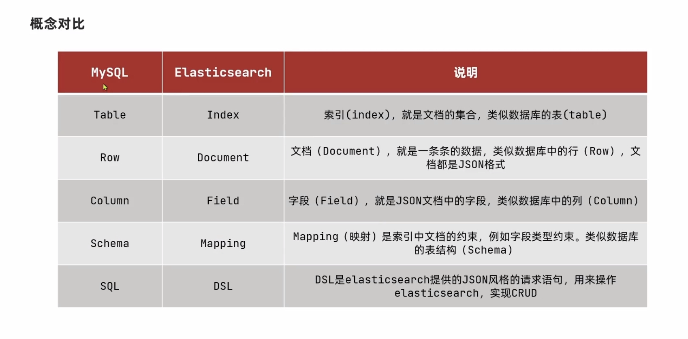
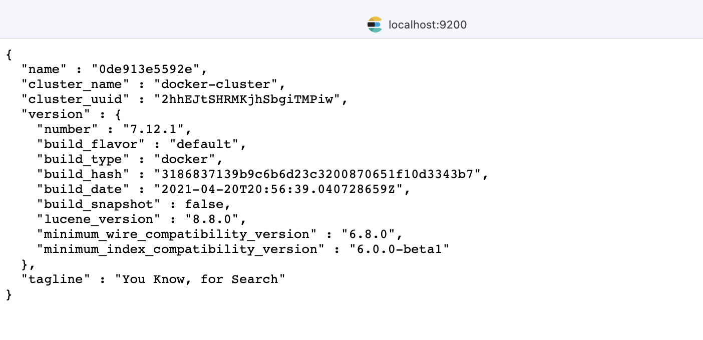
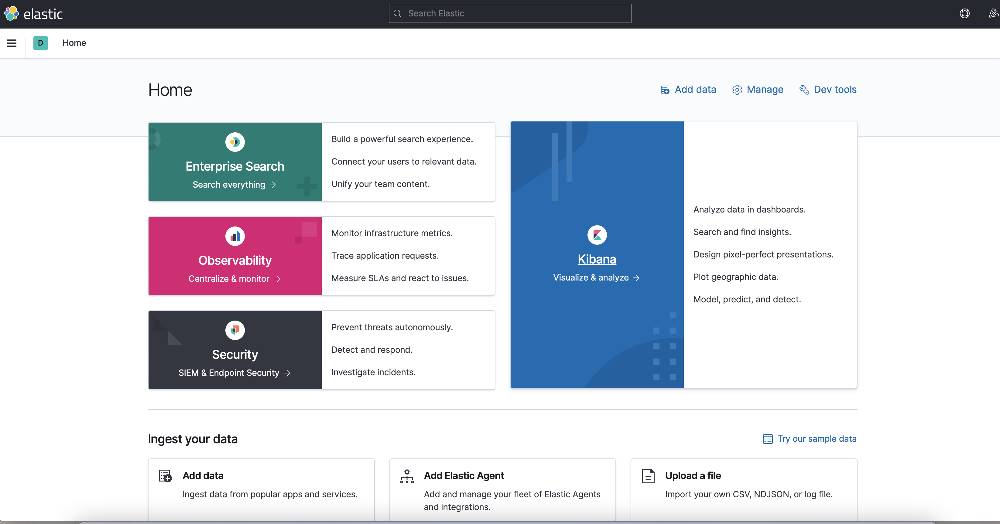
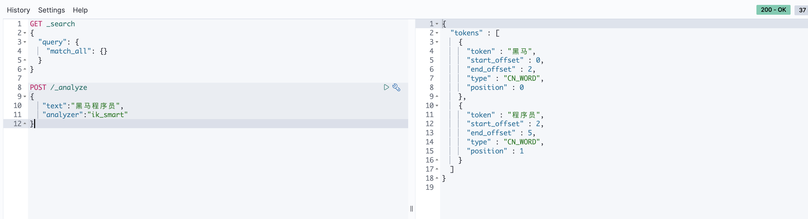
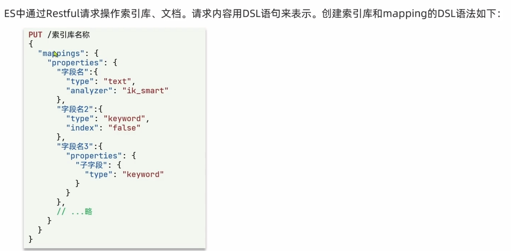

## 什么是 elasticsearch

非常强大的开源搜索引擎

## 组成

kibana,logstash,beats -> ELK (elastic stack)

- logstash beats 数据抓取
- kibana 数据可视化
- elasticsearch 存储,计算,搜索数据 基于 lucene java 搜索引擎类库（基于**倒排索引**）

## 概念

什么是文档和词条

- 每一条数据就是一个文档
- 对文档的内容分词，得到的词语就是词条
  什么是正向索引
- 基于文档 id 创建索引,逐个去查是否包含字段

什么是倒排索引

- 对文档内容分词，对词条创建索引，并记录词条所在的文档的信息，查询时先根据词条查询到文档 id，而后获取到文档

## 对比



### docker 运行

#### 运行 elasticsearch

```bash
# 创建docker网络
docker network create es-net
# 拉取镜像
docker pull elasticsearch:7.12.1
# 运行容器
docker run -d \
--name es \
-e"ES_JAVA_OPTS=-Xms512m -Xmx512m" \
-e "discovery.type=single-node" \
-v es-data:/usr/share/elasticsearch/data \
-v es-plugins:/usr/share/elasticsearch/plugins \
--privileged \
--network es-net \
-p 9200:9200 \
-p 9300:9300 \
elasticsearch:7.12.1

```

访问 ip:9200 端口


#### 运行 kibana

```bash
docker run -d \
--name kibana \
-e ELASTICSEARCH_HOSTS=http://es:9200 \
--network=es-net \
-p 5601:5601 \
kibana:7.12.1
```

访问 ip:5601 端口


#### 安装 ik 分词器

##### 网络安装

```bash
# 进入容器
docker exec -it <容器名 or 容器id> /bin/bash
# 下载
./bin/elasticsearch-plugin install https://github.com/medcl/elasticsearch-analysis-ik/releases/download/v7.12.1/elasticsearch-analysis-ik-7.12.1.zip

#退出
exit
#重启容器
docker restart <容器名 or 容器id>
```

##### 本地安装

```bash
# 查看综卷的位置
# 将 elasticsearch-analysis-ik-7.12.1.zip 复制到该目录下
docker volume inspect es-plugins
##分词拆封程度
"analyzer":
{
# 粗鲁拆分
ik_smart
# 最细拆分
ik_max_word
}

```

##### 进行测试



#### 添加词语

cd 到 ik 分词器的目录有个 config 文件夹

```bash
# 打开配置文件
vim IKAnalyzer.cfg.xml
```

```xml
<?xml version="1.0" encoding="UTF-8"?>
<!DOCTYPE properties SYSTEM "http://java.sun.com/dtd/properties.dtd">
<properties>
        <comment>IK Analyzer 扩展配置</comment>
        <!--用户可以在这里配置自己的扩展字典 -->
        <entry key="ext_dict">exc.dic</entry>
         <!--用户可以在这里配置自己的扩展停止词字典-->
        <entry key="ext_stopwords"></entry>
        <!--用户可以在这里配置远程扩展字典 -->
        <!-- <entry key="remote_ext_dict">words_location</entry> -->
        <!--用户可以在这里配置远程扩展停止词字典-->
        <!-- <entry key="remote_ext_stopwords">words_location</entry> -->
</properties>
```

在同一个目录下自己创建对应的文件

- exc.dic 的格式如下

```txt
奥利给
嘤嘤嘤
白嫖
```

- ext_stopwords 的格式如下

```txt
的
是
了
.....
```

## 索引库

### mapping 属性

- type
  - text(可分)
  - keyword(不可分)
  - 数值 long,integer,short,byte,double,float
  - 布尔 boolean
  - 日期 date
  - 对象 object
  - 数组 array
- index: 是否创建索引 默认 true
- analyzer : 指定分词器
- properties : 该字段的子属性

### 创建索引库



### 索引库操作

```json
// 创建
PUT /heima
{
  "mappings": {
    "properties": {
      "info":{
        "type": "text",
        "analyzer": "ik_smart"
      },
      "email":{
        "type": "keyword",
        "index": false
      },
      "name":{
        "type": "object",
        "properties": {
          "firstName":{
             "type":"keyword"
          },
          "lastName":{
            "type":"keyword"
          }
        }
      }
    }
  }
}

// 获取
GET /索引库
// 删除
DELETE /索引库
//  更新
PUT /索引库/_mapping
{
  "properties":{
        "新字段名":{
                "type":"integer"
        }
  }
}
```

## 文档操作

```json
// 添加文档
POST /heima/_doc/1
{
  "info":"黑马程序员java讲师",
  "email":"2908166461@qq.com",
  "name":{
    "firstName":"赵",
    "lastName":"云"
  }
}
// 查询文档
GET /heima/_doc/1

// 查询某个索引的所有数据
GET /hotel/_search

// 删除
DELETE /heima/_doc/1

//修改文档
//方式一 替换文档
POST /heima/_doc/1
{
  "info":"黑马程序员java讲师2",
  "email":"2908166461@qq.com",
  "name":{
    "firstName":"赵",
    "lastName":"云"
  }
}
// 方式二 ✨ 指定字段
POST /heima/_update/1
{
  "doc":{
    "info":"黑马程序员java讲师3"
  }
}
```

## java 客户端

springboot 项目

```xml
<!-- 主要依赖 -->
  <dependency>
            <groupId>org.elasticsearch.client</groupId>
            <artifactId>elasticsearch-rest-high-level-client</artifactId>
        </dependency>
<!-- 覆盖版本  -->
            <properties>
        <java.version>1.8</java.version>
        <elasticsearch.version>7.12.1</elasticsearch.version>
    </properties>
```

### 索引库相关操作

常量

```java
package cn.itcast.hotel.constants;

public class HotelConstants {
    public static final String HOTEL_MAPPING="{\n" +
            "  \"mappings\": {\n" +
            "    \"properties\": {\n" +
            "      \"id\":{\n" +
            "        \"type\": \"keyword\"         \n" +
            "      },\n" +
            "      \"name\":{\n" +
            "        \"type\": \"text\"\n" +
            "        , \"analyzer\": \"ik_max_word\",\n" +
            "        \"copy_to\": \"all\"\n" +
            "      },\n" +
            "      \"address\":{\n" +
            "        \"type\": \"keyword\"\n" +
            "        , \"index\": false\n" +
            "      },\n" +
            "      \"price\":{\n" +
            "        \"type\": \"integer\"\n" +
            "      },\n" +
            "      \"score\":{\n" +
            "        \"type\": \"integer\"\n" +
            "      },\n" +
            "      \"brand\":{\n" +
            "        \"type\": \"keyword\",\n" +
            "        \"copy_to\": \"all\"\n" +
            "      },\n" +
            "      \"city\":{\n" +
            "        \"type\": \"keyword\"\n" +
            "      },\n" +
            "      \"starName\":{\n" +
            "        \"type\": \"keyword\"\n" +
            "      },\n" +
            "      \"business\":{\n" +
            "        \"type\": \"keyword\",\n" +
            "        \"copy_to\": \"all\"\n" +
            "      },\n" +
            "      \"location\":{\n" +
            "        \"type\": \"geo_point\"\n" +
            "      },\n" +
            "       \"pic\":{\n" +
            "        \"type\": \"keyword\"\n" +
            "        , \"index\": false\n" +
            "      },\n" +
            "      \"all\":{\n" +
            "        \"type\": \"text\",\n" +
            "        \"analyzer\": \"ik_max_word\"\n" +
            "      }\n" +
            "    }\n" +
            "  }\n" +
            "}";
}

```

#### RestClient 操作索引

```java
package cn.itcast.hotel;

import org.apache.http.HttpHost;
import org.elasticsearch.action.admin.indices.delete.DeleteIndexRequest;
import org.elasticsearch.client.RequestOptions;
import org.elasticsearch.client.RestClient;
import org.elasticsearch.client.RestHighLevelClient;
import org.elasticsearch.client.indices.CreateIndexRequest;
import org.elasticsearch.client.indices.GetIndexRequest;
import org.elasticsearch.common.xcontent.XContentType;
import org.junit.jupiter.api.BeforeEach;
import org.junit.jupiter.api.Test;
import org.springframework.boot.test.context.SpringBootTest;

import static cn.itcast.hotel.constants.HotelConstants.HOTEL_MAPPING;

@SpringBootTest
class HotelDemoApplicationTests {

    private RestHighLevelClient restHighLevelClient;

    @Test
    void testInit() {
        System.out.println(restHighLevelClient);
    }

    @Test
    void createHotelIndex() {
        CreateIndexRequest request = new CreateIndexRequest("hotel");
        request.source(HOTEL_MAPPING, XContentType.JSON);
        try {
            restHighLevelClient.indices().create(request, RequestOptions.DEFAULT);
        } catch (Exception e) {
            e.printStackTrace();
        }

    }

    @Test
    void deleteHotelIndex() {
        DeleteIndexRequest request = new DeleteIndexRequest("hotel");
        try {
            restHighLevelClient.indices().delete(request, RequestOptions.DEFAULT);
        } catch (Exception e) {
            e.printStackTrace();
        }

    }

    @Test
    void testExistsHotelIndex() {
        GetIndexRequest request = new GetIndexRequest("hotel");
        try {
            System.out.println(restHighLevelClient.indices().exists(request, RequestOptions.DEFAULT));
        } catch (Exception e) {
            e.printStackTrace();
        }

    }

    @BeforeEach
    void setUp() {
        this.restHighLevelClient = new RestHighLevelClient(
                RestClient.builder(HttpHost.create("http://10.211.55.3:9200")));
    }
}

```

#### RestClient 操作文档

```java
package cn.itcast.hotel;

import cn.itcast.hotel.pojo.Hotel;
import cn.itcast.hotel.pojo.HotelDoc;
import cn.itcast.hotel.service.IHotelService;
import com.alibaba.fastjson.JSON;
import org.apache.http.HttpHost;
import org.elasticsearch.action.bulk.BulkRequest;
import org.elasticsearch.action.delete.DeleteRequest;
import org.elasticsearch.action.get.GetRequest;
import org.elasticsearch.action.get.GetResponse;
import org.elasticsearch.action.index.IndexRequest;
import org.elasticsearch.action.update.UpdateRequest;
import org.elasticsearch.client.RequestOptions;
import org.elasticsearch.client.RestClient;
import org.elasticsearch.client.RestHighLevelClient;
import org.elasticsearch.common.xcontent.XContentType;
import org.junit.jupiter.api.BeforeEach;
import org.junit.jupiter.api.Test;
import org.springframework.beans.factory.annotation.Autowired;
import org.springframework.boot.test.context.SpringBootTest;

import java.io.IOException;
import java.util.List;

@SpringBootTest
class HotelDocumentTests {

    private RestHighLevelClient restHighLevelClient;

    @Autowired
    private IHotelService service;

    @Test
    void testInit() {
        System.out.println(restHighLevelClient);
    }

    @Test
    void testAddDocument() {
        Hotel hotel = service.getById(61083);
        HotelDoc hotelDoc = new HotelDoc(hotel);

        //创建请求
        IndexRequest request = new IndexRequest("hotel").id(hotelDoc.getId().toString());
        request.source(JSON.toJSONString(hotelDoc), XContentType.JSON);

        try {
            restHighLevelClient.index(request, RequestOptions.DEFAULT);
        } catch (IOException e) {
            throw new RuntimeException(e);
        }
    }

    @Test
    void testGetDocumentById() {
        GetRequest request = new GetRequest("hotel", "61083");
        try {
            GetResponse documentFields = restHighLevelClient.get(request, RequestOptions.DEFAULT);
            String sourceAsString = documentFields.getSourceAsString();
            System.out.println(sourceAsString);
        } catch (IOException e) {
            throw new RuntimeException(e);
        }
    }

    @Test
    void testUpdateDocumentById() {
        //创建请求
        UpdateRequest request = new UpdateRequest("hotel", "61083");
        request.doc(
            "price",1000
        );
        try {
            restHighLevelClient.update(request, RequestOptions.DEFAULT);
        } catch (IOException e) {
            throw new RuntimeException(e);
        }
    }

    @Test
    void testDeleteDocumentById() {
        DeleteRequest request = new DeleteRequest("hotel", "61083");
        try {
            restHighLevelClient.delete(request,RequestOptions.DEFAULT);
        } catch (IOException e) {
            throw new RuntimeException(e);
        }
    }

    @Test
    void testInsertBatchDocument() {
        List<Hotel> list = service.list();
        //创建批处理请求
        BulkRequest request=new BulkRequest();
        for (Hotel hotel : list) {
            HotelDoc hotelDoc = new HotelDoc(hotel);
            request.add(new IndexRequest("hotel")
                    .id(hotelDoc.getId().toString())
                    .source(JSON.toJSONString(hotelDoc), XContentType.JSON));
        }
        try {
            restHighLevelClient.bulk(request, RequestOptions.DEFAULT);
        } catch (IOException e) {
            throw new RuntimeException(e);
        }

    }

    @BeforeEach
    void setUp() {
        this.restHighLevelClient = new RestHighLevelClient(
                RestClient.builder(HttpHost.create("http://10.211.55.3:9200")));
    }
}

```
