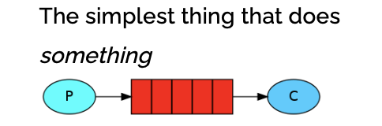
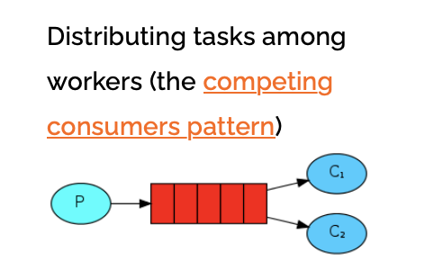
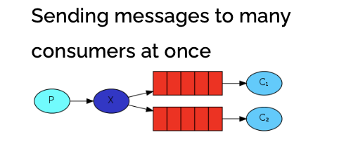
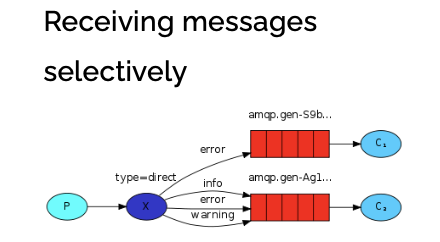
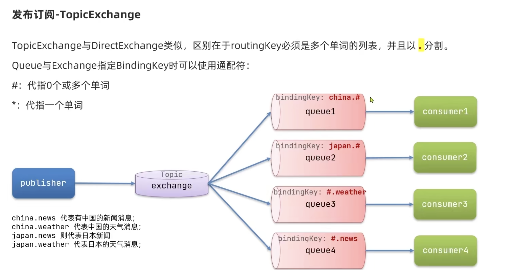

# Rabbitmq For Java

## 安装

### 通过 docker 下载 rabbitmq

```docker
# 拉取镜像
docker pull rabbitmq

# 运行容器
docker run \
-e RABBITMQ_DEFAULT_USER=erxat \
-e RABBITMQ_DEFAULT_PASS=123456 \
--name mq \
--hostname mq1 \
-p 15672:15672 \
-p 5672:5672 \
-d \
rabbitmq:latest

# 进入容器开启 界面工具
rabbitmq-plugins enable rabbitmq_management
```

## 使用

### ❌ 不使用 Spring

#### 简单队列（官方的案例）

⭐️ maven 依赖需要引入的依赖

```xml
<dependency>
    <groupId>com.rabbitmq</groupId>
    <artifactId>amqp-client</artifactId>
    <version>版本号</version>
</dependency>
```

##### 发布者

```java
// 1.建立连接
ConnectionFactory factory = new ConnectionFactory();
// 1.1.设置连接参数，分别是：主机名、端口号、vhost、用户名、密码
factory.setHost("localhost");
factory.setPort(5672);
factory.setVirtualHost("/");
factory.setUsername("erxat");
factory.setPassword("123456");
// 1.2.建立连接
Connection connection = factory.newConnection();

// 2.创建通道Channel
Channel channel = connection.createChannel();

// 3.创建队列
String queueName = "simple.queue";
channel.queueDeclare(queueName, false, false, false, null);

// 4.发送消息
String message = "hello, rabbitmq!";
channel.basicPublish("", queueName, null, message.getBytes());
System.out.println("发送消息成功：【" + message + "】");

// 5.关闭通道和连接
channel.close();
connection.close();

```

##### 消费者

```java
// 1.建立连接
ConnectionFactory factory = new ConnectionFactory();
// 1.1.设置连接参数，分别是：主机名、端口号、vhost、用户名、密码
factory.setHost("localhost");
factory.setPort(5672);
factory.setVirtualHost("/");
factory.setUsername("erxat");
factory.setPassword("123456");
// 1.2.建立连接
Connection connection = factory.newConnection();

// 2.创建通道Channel
Channel channel = connection.createChannel();

// 3.创建队列
String queueName = "simple.queue";
channel.queueDeclare(queueName, false, false, false, null);

// 4.订阅消息
channel.basicConsume(queueName, true, new DefaultConsumer(channel){
    @Override
    public void handleDelivery(String consumerTag, Envelope envelope,
                                AMQP.BasicProperties properties, byte[] body) throws IOException {
        // 5.处理消息
        String message = new String(body);
        System.out.println("接收到消息：【" + message + "】");
    }
});
System.out.println("等待接收消息。。。。");

```

### ✅ 使用 SpringBoot

#### 简单队列模型（一个发布者一个消费者）



📖 maven 依赖需要引入的依赖

```xml
<!--AMQP依赖，包含RabbitMQ-->
<dependency>
    <groupId>org.springframework.boot</groupId>
    <artifactId>spring-boot-starter-amqp</artifactId>
</dependency>
```

📖 spring application.yaml 配置

```yaml
spring:
  rabbitmq:
    host: localhost
    port: 5672
    username: erxat
    password: 123456
    virtual-host: /
```

##### 发布者

⭐️ 注入 RabbitTemplate

```java
@Autowired
private RabbitTemplate rabbitTemplate;

@Test
public void testSendMessage2SimpleQueue() {
    String queueName = "simple.queue";
    String message = "hello, spring amqp!";
    rabbitTemplate.convertAndSend(queueName,message);
}

```

##### 消费者

写一个类用于事件的监听 注解 **@RabbitListener**

```java
@Component
public class MyRabbitListener {

    @RabbitListener(queues = "simple.queue")
    public void simpleOne(String msg) {
        System.out.println("接收到消息了:" + msg);
        }
    }

```

#### 工作队列模型（一个发布者多个消费者）



##### 发布者

发布 50 条消息让两个消费者**交替**消费

```java
@Test
public void testSendMessage2WorkQueue() throws InterruptedException {
    String queueName = "simple.queue";
    String message = "hello, message__";
    for (int i = 1; i <= 50; i++) {
        rabbitTemplate.convertAndSend(queueName, message + i);
        Thread.sleep(20);
    }
}
```

##### 消费者

⭐️ **消息预取** 设置消费者每次只消费一个（这样消费者每次就会根据自身能力取数据了）

```yaml
spring:
  rabbitmq:
    host: localhost # rabbitMQ的ip地址
    port: 5672 # 端口
    username: erxat
    password: 123456
    virtual-host: /
    listener:
      simple:
        prefetch: 1
```

注册两个消费者在同一个队列

```java
@RabbitListener(queues = "simple.queue")
public void listenWorkQueue1(String msg) throws InterruptedException {
    System.out.println("消费者1接收到消息：【" + msg + "】" + LocalTime.now());
    Thread.sleep(20);
}

@RabbitListener(queues = "simple.queue")
public void listenWorkQueue2(String msg) throws InterruptedException {
    System.err.println("消费者2........接收到消息：【" + msg + "】" + LocalTime.now());
    Thread.sleep(200);
}

```

#### 发布订阅模型- _**fanout exchange**_（多队列 多个消费者收到同一个消息）

✅ 交换机



##### 配置

在 springboot 声明一个配置类

```java
@Configuration
public class FanoutConfig {
    // 声明一个交换机 Bean
    @Bean
    public FanoutExchange fanoutExchange(){
        return new FanoutExchange("itcast.fanout");
    }

    // 声明队列1
    @Bean
    public Queue fanoutQueue1(){
        return new Queue("fanout.queue1");
    }

    // 绑定队列1到交换机
    @Bean
    public Binding fanoutBinding1(Queue fanoutQueue1, FanoutExchange fanoutExchange){
        return BindingBuilder
                .bind(fanoutQueue1)
                .to(fanoutExchange);
    }

    // 声明队列2
    @Bean
    public Queue fanoutQueue2(){
        return new Queue("fanout.queue2");
    }

    // 绑定队列2到交换机
    @Bean
    public Binding fanoutBinding2(Queue fanoutQueue2, FanoutExchange fanoutExchange){
        return BindingBuilder
                .bind(fanoutQueue2)
                .to(fanoutExchange);
    }
}

```

##### 发布者

给交换机发消息

```java
@Test
public void testSendFanoutExchange() {
    // 交换机名称
    String exchangeName = "itcast.fanout";
    // 消息
    String message = "hello, every one!";
    // 发送消息
    rabbitTemplate.convertAndSend(exchangeName, "", message);
}

```

##### 消费者

声明两个监听器

```java
@RabbitListener(queues = "fanout.queue1")
public void listenFanoutQueue1(String msg) {
    System.out.println("消费者接收到fanout.queue1的消息：【" + msg + "】");
}

@RabbitListener(queues = "fanout.queue2")
public void listenFanoutQueue2(String msg) {
    System.out.println("消费者接收到fanout.queue2的消息：【" + msg + "】");
}

```

#### 发布订阅模型- _**direct exchange**_（路由模式 可以发消息给指定的 queue）



##### 消费者

⭐️ 每个队列需要绑定 _**key**_ （可以是多个）

```java
@RabbitListener(bindings = @QueueBinding(
        value = @Queue(name = "direct.queue1"),
        exchange = @Exchange(name = "itcast.direct"),
        key = {"red", "blue"}
))
public void listenDirectQueue1(String msg) {
    System.out.println("消费者接收到direct.queue1的消息：【" + msg + "】");
}

@RabbitListener(bindings = @QueueBinding(
        value = @Queue(name = "direct.queue2"),
        exchange = @Exchange(name = "itcast.direct"),
        key = {"red", "yellow"}
))
public void listenDirectQueue2(String msg) {
    System.out.println("消费者接收到direct.queue2的消息：【" + msg + "】");
}

```

##### 发布者

给 key 为 red 的队列发消息

```java
@Test
public void testSendDirectExchange() {
    // 交换机名称
    String exchangeName = "itcast.direct";
    // 消息
    String message = "hello, red!";
    // 发送消息
    rabbitTemplate.convertAndSend(exchangeName, "yellow", message);
}

```

#### 发布订阅模型- _**topic exchange**_（）



##### 消费者

```java
@RabbitListener(bindings = @QueueBinding(
        value = @Queue(name = "topic.queue1"),
        exchange = @Exchange(name = "itcast.topic", type = ExchangeTypes.TOPIC),
        key = "china.#"
))
public void listenTopicQueue1(String msg){
    System.out.println("消费者接收到topic.queue1的消息：【" + msg + "】");
}

@RabbitListener(bindings = @QueueBinding(
        value = @Queue(name = "topic.queue2"),
        exchange = @Exchange(name = "itcast.topic", type = ExchangeTypes.TOPIC),
        key = "#.news"
))
public void listenTopicQueue2(String msg){
    System.out.println("消费者接收到topic.queue2的消息：【" + msg + "】");
}


```

##### 发布者

```java

@Test
public void testSendTopicExchange() {
    // 交换机名称
    String exchangeName = "itcast.topic";
    // 消息
    String message = "今天天气不错，我的心情好极了!";
    // 发送消息
    rabbitTemplate.convertAndSend(exchangeName, "china.weather", message);
}
```

#### 消息转换器

转换发送消息的格式
<br/>

⭐️ maven 依赖需要引入的依赖

```xml
<dependency>
    <groupId>com.fasterxml.jackson.core</groupId>
    <artifactId>jackson-databind</artifactId>
</dependency>
```

声明 Bean 覆盖之前的 rabiitmq 自身的消息转换器

```java
@Bean
public MessageConverter messageConverter(){
    return new Jackson2JsonMessageConverter();
}
```

##### 消费者

**声明队列**

```java
@Bean
public Queue objectQueue(){
    return new Queue("object.queue");
}
```

```java
 @RabbitListener(queues = "object.queue")
 public void listenObjectQueue(Map<String,Object> msg){
     System.out.println("接收到object.queue的消息：" + msg);
 }
```

##### 发布者

```java
@Test
public void testSendObjectQueue() {
    // 消息
    Map<String,Object> map = new HashMap<>();
    map.put("key1","Hello");
    // 发送消息
    rabbitTemplate.convertAndSend("", "object.queue", map);
}
```
