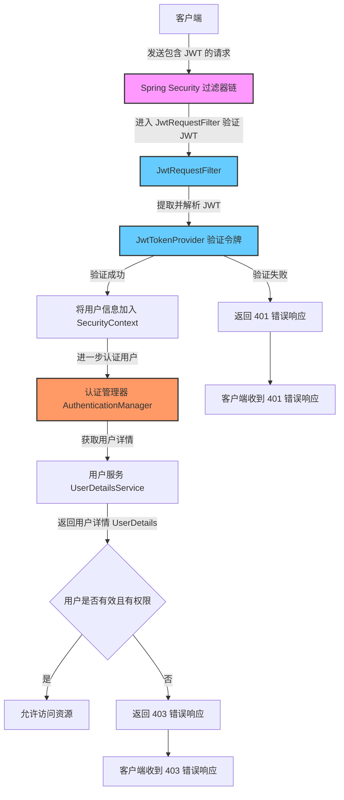

## 开始

### 1. 什么是 Spring Security？

**Spring Security** 是一个强大的、可扩展的认证和授权框架，主要用于保护 Java 应用程序的安全。它提供了多种安全特性，比如用户身份认证、访问权限控制、会话管理、密码加密等。Spring Security 是 Spring 家族中的重要模块，特别适合 Spring Boot 应用。

### 2. Spring Security 的主要特性

- **认证**：确认用户的身份（如用户名和密码的验证）。
- **授权**：控制用户可以访问哪些资源。
- **防护攻击**：自动提供 CSRF（跨站请求伪造）防护，保护应用免受常见攻击。
- **会话管理**：包括控制用户会话、并发会话数的限制。
- **密码加密**：提供 BCrypt 等加密方式安全存储密码。
- **集成 OAuth2 和 OpenID**：支持第三方登录和 SSO（单点登录）。

### 3. 引入 Spring Security 依赖

在 Spring Boot 项目中，Spring Security 的依赖可以直接通过 `spring-boot-starter-security` 引入。这个依赖包含了 Spring Security 的核心功能。

在 `pom.xml` 中添加：

```xml
<dependency>
    <groupId>org.springframework.boot</groupId>
    <artifactId>spring-boot-starter-security</artifactId>
</dependency>
```

Spring Boot 会自动配置一些默认的安全设置，如默认登录页面和基本的表单登录功能。

## 认证与授权

### 1. 认证（Authentication）

**认证** 是确认用户身份的过程，常见的方式有用户名密码认证、基于数据库的认证等。我们会用以下两种方式：

#### 1.1 用户名和密码认证（内存用户）

这是最基本的认证方式，适合开发和测试场景。在 Spring Security 中，我们可以使用 `InMemoryUserDetailsManager` 配置一组内存中的用户名和密码。

**实现步骤：**

1. 配置 `UserDetailsService` 来定义内存用户。
2. 设置用户的用户名、密码和角色。

示例代码如下：

```java
import org.springframework.context.annotation.Bean;
import org.springframework.context.annotation.Configuration;
import org.springframework.security.config.annotation.web.builders.HttpSecurity;
import org.springframework.security.core.userdetails.User;
import org.springframework.security.core.userdetails.UserDetails;
import org.springframework.security.core.userdetails.UserDetailsService;
import org.springframework.security.provisioning.InMemoryUserDetailsManager;
import org.springframework.security.web.SecurityFilterChain;

@Configuration
public class SecurityConfig {

    @Bean
    public SecurityFilterChain securityFilterChain(HttpSecurity http) throws Exception {
        http
            .authorizeRequests()
                .antMatchers("/public/**").permitAll()
                .anyRequest().authenticated()
            .and()
            .formLogin()
                .permitAll()
            .and()
            .logout()
                .permitAll();
        return http.build();
    }

    @Bean
    public UserDetailsService inMemoryUserDetailsService() {
        UserDetails user = User.withDefaultPasswordEncoder()
            .username("user")
            .password("password")
            .roles("USER")
            .build();

        UserDetails admin = User.withDefaultPasswordEncoder()
            .username("admin")
            .password("admin")
            .roles("ADMIN")
            .build();

        return new InMemoryUserDetailsManager(user, admin);
    }
}
```

这样配置后，内存中创建了两个用户 `user` 和 `admin`，可以用它们测试登录功能。

#### 1.2 基于数据库的认证

在实际项目中，我们通常将用户数据存储在数据库中。通过配置 `JdbcUserDetailsManager` 或自定义 `UserDetailsService`，可以实现数据库认证。

**步骤：**

1. 定义数据库表结构存储用户信息（用户名、密码、角色等）。
2. 创建自定义 `UserDetailsService` 实现类，从数据库中加载用户信息。
3. 配置密码加密。

**数据库表结构：**

假设我们有以下两张表：

```sql
CREATE TABLE users (
    id BIGINT PRIMARY KEY AUTO_INCREMENT,
    username VARCHAR(50) NOT NULL UNIQUE,
    password VARCHAR(100) NOT NULL,
    enabled BOOLEAN NOT NULL DEFAULT TRUE
);

CREATE TABLE authorities (
    user_id BIGINT NOT NULL,
    authority VARCHAR(50) NOT NULL,
    FOREIGN KEY (user_id) REFERENCES users(id)
);

-- 插入用户数据
INSERT INTO users (username, password, enabled) 
VALUES 
    ('user1', '$2a$10$9h8r1j/Ro9N.5zK0z2C2weUBGEjlXX9hXdxPZB8dyT.TnAIBJ6OUy', true), -- 密码为 "password1"
    ('admin1', '$2a$10$VHcYvLjZ8xYfE3sh/.Rjcuj2ORP2yAFlLP97F/Hxa0Gi/uqg3nnKu', true); -- 密码为 "admin123"

-- 插入角色数据
INSERT INTO authorities (user_id, authority) 
VALUES 
    (1, 'ROLE_USER'),   -- user1 拥有 USER 角色
    (2, 'ROLE_ADMIN');  -- admin1 拥有 ADMIN 角色

```

**配置代码：**

```java
import org.springframework.context.annotation.Bean;
import org.springframework.context.annotation.Configuration;
import org.springframework.security.config.annotation.web.builders.HttpSecurity;
import org.springframework.security.config.annotation.web.configuration.EnableWebSecurity;
import org.springframework.security.core.userdetails.UserDetailsService;
import org.springframework.security.crypto.bcrypt.BCryptPasswordEncoder;
import org.springframework.security.crypto.password.PasswordEncoder;
import org.springframework.security.provisioning.JdbcUserDetailsManager;
import org.springframework.security.web.SecurityFilterChain;

import javax.sql.DataSource;

@Configuration
@EnableWebSecurity
public class SecurityConfig {

    @Bean
    public SecurityFilterChain securityFilterChain(HttpSecurity http) throws Exception {
        http
            .authorizeRequests()
                .antMatchers("/public/**").permitAll()
                .anyRequest().authenticated()
            .and()
            .formLogin()
                .permitAll()
            .and()
            .logout()
                .permitAll();
        return http.build();
    }

    @Bean
    public UserDetailsService userDetailsService(DataSource dataSource) {
        JdbcUserDetailsManager userDetailsService = new JdbcUserDetailsManager(dataSource);
        userDetailsService.setUsersByUsernameQuery("SELECT username, password, enabled FROM users WHERE username = ?");
        userDetailsService.setAuthoritiesByUsernameQuery("SELECT username, authority FROM authorities WHERE username = ?");
        return userDetailsService;
    }

    @Bean
    public PasswordEncoder passwordEncoder() {
        return new BCryptPasswordEncoder();
    }
}
```

在这个配置中：

- `userDetailsService(DataSource dataSource)` 使用 `JdbcUserDetailsManager` 从数据库中加载用户数据。
- `setUsersByUsernameQuery` 和 `setAuthoritiesByUsernameQuery` 分别指定用户和角色的查询 SQL。
- `passwordEncoder()` 配置了 `BCryptPasswordEncoder`，用于加密用户密码，确保密码的安全性。

### 2. 授权（Authorization）

授权控制用户可以访问哪些资源。在 Spring Security 中，可以通过角色来实现 **基于角色的访问控制**（RBAC）。

#### 基本授权配置

在 `securityFilterChain` 中，我们通过 `.authorizeRequests()` 方法来设置 URL 的访问权限：

```java
@Bean
public SecurityFilterChain securityFilterChain(HttpSecurity http) throws Exception {
    http
        .authorizeRequests()
            .antMatchers("/admin/**").hasRole("ADMIN") // 仅 ADMIN 角色可以访问
            .antMatchers("/user/**").hasAnyRole("USER", "ADMIN") // USER 和 ADMIN 角色可以访问
            .antMatchers("/public/**").permitAll() // 公共资源无需认证
            .anyRequest().authenticated() // 其他请求需要认证
        .and()
        .formLogin()
            .permitAll()
        .and()
        .logout()
            .permitAll();
    return http.build();
}
```

## 自定义登录页

### 1. 使用 Spring Security 提供的默认登录页面

在默认配置下，Spring Security 会自动生成一个简单的登录页面用于表单登录。

如果我们不自定义登录页面，只需确保 Spring Security 的基本配置如下：

```java
import org.springframework.context.annotation.Bean;
import org.springframework.context.annotation.Configuration;
import org.springframework.security.config.annotation.web.builders.HttpSecurity;
import org.springframework.security.web.SecurityFilterChain;

@Configuration
@EnableWebSecurity
public class SecurityConfig {

    @Bean
    public SecurityFilterChain securityFilterChain(HttpSecurity http) throws Exception {
        http
            .authorizeRequests()
                .antMatchers("/public/**").permitAll() // 公共资源可以访问
                .anyRequest().authenticated()          // 其他请求需要认证
            .and()
            .formLogin() // 开启表单登录
            .and()
            .logout().permitAll(); // 开启登出
        return http.build();
    }
}
```

在此配置下，访问任何受保护的资源时，Spring Security 会自动跳转到 `/login` 路径，显示一个默认的登录页面。

### 2. 自定义登录页面

自定义登录页面可以提高用户体验，使得页面风格符合应用的整体设计。Spring Security 支持使用自定义页面来替代默认的登录页面。

#### 自定义登录页面的步骤

1. 创建一个 HTML 登录页面。
2. 配置 Spring Security 指定自定义登录页面的 URL。
3. 自定义登录成功和失败的处理逻辑。

#### 2.1 创建自定义登录页面

在 `resources/templates` 目录下新建 `login.html` 文件（假设使用 Thymeleaf 作为模板引擎）：

```html
<!DOCTYPE html>
<html xmlns:th="http://www.thymeleaf.org">
<head>
    <title>登录页面</title>
    <link rel="stylesheet" href="/css/styles.css"> <!-- 自定义样式 -->
</head>
<body>
    <div class="login-container">
        <h2>用户登录</h2>
        <form th:action="@{/login}" method="post">
            <div class="form-group">
                <label for="username">用户名:</label>
                <input type="text" id="username" name="username" required>
            </div>
            <div class="form-group">
                <label for="password">密码:</label>
                <input type="password" id="password" name="password" required>
            </div>
            <button type="submit">登录</button>
            <div th:if="${param.error}" class="error">
                用户名或密码错误，请重试。
            </div>
            <div th:if="${param.logout}" class="message">
                您已成功登出。
            </div>
        </form>
    </div>
</body>
</html>
```

> 注意：Spring Security 默认将登录请求的路径设为 `/login`，请求方式为 `POST`，我们在 `form` 的 `action` 中指定了这一路径。

#### 2.2 修改 Spring Security 配置以启用自定义登录页面

在 Spring Security 配置中设置登录页面的 URL，并自定义登录成功和失败的处理。

```java
import org.springframework.context.annotation.Bean;
import org.springframework.context.annotation.Configuration;
import org.springframework.security.config.annotation.web.builders.HttpSecurity;
import org.springframework.security.web.SecurityFilterChain;
import org.springframework.security.web.authentication.AuthenticationFailureHandler;
import org.springframework.security.web.authentication.AuthenticationSuccessHandler;
import org.springframework.security.web.authentication.SimpleUrlAuthenticationFailureHandler;
import org.springframework.security.web.authentication.SimpleUrlAuthenticationSuccessHandler;

@Configuration
public class SecurityConfig {

    @Bean
    public SecurityFilterChain securityFilterChain(HttpSecurity http) throws Exception {
        http
            .authorizeRequests()
                .antMatchers("/public/**", "/login").permitAll() // 允许访问公共资源和登录页面
                .anyRequest().authenticated() // 其他请求需要认证
            .and()
            .formLogin()
                .loginPage("/login")                      // 自定义登录页面
                .loginProcessingUrl("/perform_login")     // 登录表单提交 URL
                .successHandler(authenticationSuccessHandler()) // 自定义登录成功处理
                .failureHandler(authenticationFailureHandler()) // 自定义登录失败处理
            .and()
            .logout()
                .logoutUrl("/perform_logout")              // 自定义登出 URL
                .logoutSuccessUrl("/login?logout")         // 登出成功后跳转
                .permitAll();
        return http.build();
    }

    @Bean
    public AuthenticationSuccessHandler authenticationSuccessHandler() {
        return new SimpleUrlAuthenticationSuccessHandler("/home"); // 登录成功后跳转页面
    }

    @Bean
    public AuthenticationFailureHandler authenticationFailureHandler() {
        return new SimpleUrlAuthenticationFailureHandler("/login?error=true"); // 登录失败跳转页面
    }
}
```

#### 说明：

- `loginPage("/login")`：指定自定义的登录页面 URL。
- `loginProcessingUrl("/perform_login")`：指定表单提交的 URL。
- `successHandler(authenticationSuccessHandler())`：自定义登录成功处理，将用户重定向到 `/home` 页面。
- `failureHandler(authenticationFailureHandler())`：自定义登录失败处理，失败时重定向到 `/login?error=true`，并在页面上显示错误信息。

### 3. 自定义登录成功和失败的处理

通过 `AuthenticationSuccessHandler` 和 `AuthenticationFailureHandler`，可以更灵活地控制用户登录成功和失败时的行为。例如，可以在登录成功后记录用户登录的时间和 IP 地址，或者在登录失败时计数失败次数以便启用锁定等。

#### 示例：自定义登录成功处理

```java
import org.springframework.security.core.Authentication;
import org.springframework.security.web.authentication.AuthenticationSuccessHandler;
import org.springframework.stereotype.Component;

import javax.servlet.ServletException;
import javax.servlet.http.HttpServletRequest;
import javax.servlet.http.HttpServletResponse;
import java.io.IOException;

@Component
public class CustomAuthenticationSuccessHandler implements AuthenticationSuccessHandler {

    @Override
    public void onAuthenticationSuccess(HttpServletRequest request, HttpServletResponse response, Authentication authentication) throws IOException, ServletException {
        System.out.println("登录成功，用户名：" + authentication.getName());
        response.sendRedirect("/home"); // 登录成功后重定向到 /home
    }
}
```

在配置中替换原来的 `SimpleUrlAuthenticationSuccessHandler`：

```java
@Bean
public AuthenticationSuccessHandler authenticationSuccessHandler() {
    return new CustomAuthenticationSuccessHandler();
}
```

#### 示例：自定义登录失败处理

```java
import org.springframework.security.core.AuthenticationException;
import org.springframework.security.web.authentication.AuthenticationFailureHandler;
import org.springframework.stereotype.Component;

import javax.servlet.ServletException;
import javax.servlet.http.HttpServletRequest;
import javax.servlet.http.HttpServletResponse;
import java.io.IOException;

@Component
public class CustomAuthenticationFailureHandler implements AuthenticationFailureHandler {

    @Override
    public void onAuthenticationFailure(HttpServletRequest request, HttpServletResponse response, AuthenticationException exception) throws IOException, ServletException {
        System.out.println("登录失败，错误：" + exception.getMessage());
        response.sendRedirect("/login?error=true"); // 登录失败后重定向
    }
}
```

在配置中替换原来的 `SimpleUrlAuthenticationFailureHandler`：

```
java复制代码@Bean
public AuthenticationFailureHandler authenticationFailureHandler() {
    return new CustomAuthenticationFailureHandler();
}
```

### 4. 实现登出功能

在 `SecurityConfig` 中配置登出 URL 和登出后的跳转：

```java
java复制代码.logout()
    .logoutUrl("/perform_logout")              // 自定义登出 URL
    .logoutSuccessUrl("/login?logout")         // 登出成功后跳转
    .permitAll();
```

## JWT（JSON Web Token）验证

在 Spring Security 中使用 JWT（JSON Web Token）认证可以实现无状态、基于令牌的认证方式。JWT 认证常用于 RESTful API 项目，因为不需要服务器在会话中保存用户状态。

### 使用 JWT 认证的步骤

1. **生成 JWT 令牌**：用户登录后，服务器验证凭据，并生成包含用户信息的 JWT 令牌。
2. **传输 JWT 令牌**：客户端接收令牌并将其保存在客户端（如本地存储或 Cookie 中）。
3. **请求时携带令牌**：客户端在每次请求时将令牌放入请求头的 `Authorization` 字段。
4. **服务器验证令牌**：服务器验证请求中的令牌以确认用户身份，无需保存会话状态。

#### 1. 添加依赖

首先，在 `pom.xml` 中添加 JWT 所需的依赖：

```xml
<dependency>
    <groupId>io.jsonwebtoken</groupId>
    <artifactId>jjwt</artifactId>
    <version>0.9.1</version>
</dependency>

<dependency>
    <groupId>cn.hutool</groupId>
    <artifactId>hutool-all</artifactId>
    <version>5.8.25</version>
</dependency>
```

#### 2. 配置 JWT 生成与验证工具类

我们需要创建一个工具类来生成和解析 JWT 令牌。在此示例中，我们会用 `HS256` 算法加密，并定义一个密钥。

```java
package com.yili.util;

import cn.hutool.core.date.DateUtil;
import cn.hutool.core.util.StrUtil;
import io.jsonwebtoken.Claims;
import io.jsonwebtoken.Jwts;
import io.jsonwebtoken.SignatureAlgorithm;
import org.slf4j.Logger;
import org.slf4j.LoggerFactory;
import org.springframework.beans.factory.annotation.Value;
import org.springframework.security.core.userdetails.UserDetails;
import org.springframework.stereotype.Component;

import java.util.Date;
import java.util.HashMap;
import java.util.Map;

/**
 * JwtToken生成的工具类
 * JWT token的格式：header.payload.signature
 * header的格式（算法、token的类型）：
 * {"alg": "HS512","typ": "JWT"}
 * payload的格式（用户名、创建时间、生成时间）：
 * {"sub":"wang","created":1489079981393,"exp":1489684781}
 * signature的生成算法：
 * HMACSHA512(base64UrlEncode(header) + "." +base64UrlEncode(payload),secret)
 */
@Component
public class JwtUtil {
    private static final Logger LOGGER = LoggerFactory.getLogger(JwtUtil.class);
    private static final String CLAIM_KEY_USERNAME = "sub";
    private static final String CLAIM_KEY_CREATED = "created";
    @Value("${jwt.secret}")
    private String secret;
    @Value("${jwt.expiration}")
    private Long expiration;
    @Value("${jwt.tokenHead}")
    private String tokenHead;

    /**
     * 根据负责生成JWT的token
     */
    private String generateToken(Map<String, Object> claims) {
        return Jwts.builder()
                .setClaims(claims)
                .setExpiration(generateExpirationDate())
                .signWith(SignatureAlgorithm.HS512, secret)
                .compact();
    }

    /**
     * 从token中获取JWT中的负载
     */
    private Claims getClaimsFromToken(String token) {
        Claims claims = null;
        try {
            claims = Jwts.parser()
                    .setSigningKey(secret)
                    .parseClaimsJws(token)
                    .getBody();
        } catch (Exception e) {
            LOGGER.info("JWT格式验证失败:{}", token);
        }
        return claims;
    }

    /**
     * 生成token的过期时间
     */
    private Date generateExpirationDate() {
        return new Date(System.currentTimeMillis() + expiration * 1000);
    }

    /**
     * 从token中获取登录用户名
     */
    public String getUserNameFromToken(String token) {
        String username;
        try {
            Claims claims = getClaimsFromToken(token);
            username = claims.getSubject();
        } catch (Exception e) {
            username = null;
        }
        return username;
    }


    /**
     * 验证token是否还有效
     *
     * @param token       客户端传入的token
     * @param userDetails 从数据库中查询出来的用户信息
     */
    public boolean validateToken(String token, UserDetails userDetails) {
        String username = getUserNameFromToken(token);
        return username.equals(userDetails.getUsername()) && !isTokenExpired(token);
    }

    /**
     * 判断token是否已经失效
     */
    private boolean isTokenExpired(String token) {
        Date expiredDate = getExpiredDateFromToken(token);
        return expiredDate.before(new Date());
    }

    /**
     * 从token中获取过期时间
     */
    private Date getExpiredDateFromToken(String token) {
        Claims claims = getClaimsFromToken(token);
        return claims.getExpiration();
    }

    /**
     * 根据用户信息生成token
     */
    public String generateToken(UserDetails userDetails) {
        Map<String, Object> claims = new HashMap<>();
        claims.put(CLAIM_KEY_USERNAME, userDetails.getUsername());
        claims.put(CLAIM_KEY_CREATED, new Date());
        return generateToken(claims);
    }

    /**
     * 当原来的token没过期时是可以刷新的
     *
     * @param oldToken 带tokenHead的token
     */
    public String refreshHeadToken(String oldToken) {
        if(StrUtil.isEmpty(oldToken)){
            return null;
        }
        String token = oldToken.substring(tokenHead.length());
        if(StrUtil.isEmpty(token)){
            return null;
        }
        //token校验不通过
        Claims claims = getClaimsFromToken(token);
        if(claims==null){
            return null;
        }
        //如果token已经过期，不支持刷新
        if(isTokenExpired(token)){
            return null;
        }
        //如果token在30分钟之内刚刷新过，返回原token
        if(tokenRefreshJustBefore(token,30*60)){
            return token;
        }else{
            claims.put(CLAIM_KEY_CREATED, new Date());
            return generateToken(claims);
        }
    }

    /**
     * 判断token在指定时间内是否刚刚刷新过
     * @param token 原token
     * @param time 指定时间（秒）
     */
    private boolean tokenRefreshJustBefore(String token, int time) {
        Claims claims = getClaimsFromToken(token);
        Date created = claims.get(CLAIM_KEY_CREATED, Date.class);
        Date refreshDate = new Date();
        //刷新时间在创建时间的指定时间内
        if(refreshDate.after(created)&&refreshDate.before(DateUtil.offsetSecond(created,time))){
            return true;
        }
        return false;
    }
}
```

#### 3. 自定义过滤器拦截并验证 JWT

在用户请求 API 时，我们会用过滤器检查 `Authorization` 请求头中的 JWT 令牌，并在验证成功后将用户信息放入 Spring Security 的上下文中。

```java
import io.jsonwebtoken.ExpiredJwtException;
import org.springframework.beans.factory.annotation.Autowired;
import org.springframework.security.authentication.UsernamePasswordAuthenticationToken;
import org.springframework.security.core.context.SecurityContextHolder;
import org.springframework.security.core.userdetails.UserDetails;
import org.springframework.security.core.userdetails.UserDetailsService;
import org.springframework.security.web.authentication.WebAuthenticationDetailsSource;
import org.springframework.stereotype.Component;
import org.springframework.web.filter.OncePerRequestFilter;

import javax.servlet.FilterChain;
import javax.servlet.ServletException;
import javax.servlet.http.HttpServletRequest;
import javax.servlet.http.HttpServletResponse;
import java.io.IOException;

@Component
public class JwtRequestFilter extends OncePerRequestFilter {

    @Autowired
    private JwtUtil jwtUtil;

    @Autowired
    private UserDetailsService userDetailsService;

    @Override
    protected void doFilterInternal(HttpServletRequest request, HttpServletResponse response, FilterChain chain)
            throws ServletException, IOException {
        
        final String authorizationHeader = request.getHeader("Authorization");

        String username = null;
        String jwt = null;

        // 提取 JWT 令牌
        if (authorizationHeader != null && authorizationHeader.startsWith("Bearer ")) {
            jwt = authorizationHeader.substring(7);
            try {
                username = jwtUtil.extractUsername(jwt);
            } catch (ExpiredJwtException e) {
                logger.warn("JWT 已过期: " + e.getMessage());
            }
        }

        // 验证令牌
        if (username != null && SecurityContextHolder.getContext().getAuthentication() == null) {
            UserDetails userDetails = userDetailsService.loadUserByUsername(username);

            if (jwtUtil.validateToken(jwt, userDetails.getUsername())) {
                UsernamePasswordAuthenticationToken authenticationToken = new UsernamePasswordAuthenticationToken(
                        userDetails, null, userDetails.getAuthorities());
                authenticationToken.setDetails(new WebAuthenticationDetailsSource().buildDetails(request));
                SecurityContextHolder.getContext().setAuthentication(authenticationToken);
            }
        }

        chain.doFilter(request, response);
    }
}
```

#### 4. 配置 Spring Security 并将 JWT 过滤器添加到过滤链

将自定义的 `JwtRequestFilter` 添加到 Spring Security 的过滤链中，并关闭 Spring Security 自带的会话管理。

```java
import org.springframework.context.annotation.Bean;
import org.springframework.context.annotation.Configuration;
import org.springframework.security.authentication.AuthenticationManager;
import org.springframework.security.config.annotation.authentication.builders.AuthenticationManagerBuilder;
import org.springframework.security.config.annotation.web.builders.HttpSecurity;
import org.springframework.security.config.annotation.web.configuration.EnableWebSecurity;
import org.springframework.security.config.http.SessionCreationPolicy;
import org.springframework.security.web.SecurityFilterChain;
import org.springframework.security.web.authentication.UsernamePasswordAuthenticationFilter;

@Configuration
@EnableWebSecurity
public class SecurityConfig {

    @Autowired
    private JwtRequestFilter jwtRequestFilter;

    @Bean
    public SecurityFilterChain securityFilterChain(HttpSecurity http) throws Exception {
        http
            .csrf().disable()
            .authorizeRequests()
                .antMatchers("/authenticate").permitAll() // 登录端点允许所有人访问
                .anyRequest().authenticated()            // 其他端点需要认证
            .and()
            .sessionManagement()
                .sessionCreationPolicy(SessionCreationPolicy.STATELESS); // 无状态

        http.addFilterBefore(jwtRequestFilter, UsernamePasswordAuthenticationFilter.class);
        return http.build();
    }
}
```

#### 5. 实现登录认证接口，生成 JWT 令牌

创建一个控制器，用于处理登录请求。验证用户凭据后生成 JWT 令牌。

```java
import org.springframework.beans.factory.annotation.Autowired;
import org.springframework.security.authentication.AuthenticationManager;
import org.springframework.security.authentication.UsernamePasswordAuthenticationToken;
import org.springframework.security.core.AuthenticationException;
import org.springframework.security.core.userdetails.UserDetails;
import org.springframework.security.core.userdetails.UserDetailsService;
import org.springframework.web.bind.annotation.*;

@RestController
public class AuthController {

    @Autowired
    private AuthenticationManager authenticationManager;

    @Autowired
    private JwtUtil jwtUtil;

    @Autowired
    private UserDetailsService userDetailsService;

    @PostMapping("/authenticate")
    public String createAuthenticationToken(@RequestBody AuthRequest authRequest) throws Exception {
        try {
            authenticationManager.authenticate(
                new UsernamePasswordAuthenticationToken(authRequest.getUsername(), authRequest.getPassword())
            );
        } catch (AuthenticationException e) {
            throw new Exception("用户名或密码不正确", e);
        }

        final UserDetails userDetails = userDetailsService.loadUserByUsername(authRequest.getUsername());
        return jwtUtil.generateToken(userDetails.getUsername());
    }
}

class AuthRequest {
    private String username;
    private String password;
    
    // Getters and setters
}
```
#### 6.流程图



## 方法级权限控制

在 Spring Security 中，**方法级权限控制**是通过注解和 AOP（面向切面编程）来实现的。它允许我们在方法级别上进行权限控制，而不是仅仅在 URL 路径级别。

1. **启用注解支持**

   在 Spring Security 中，我们需要启用方法级权限控制的支持。通常是在 Spring Boot 配置类中添加 `@EnableGlobalMethodSecurity` 注解。

   ```java
   复制代码import org.springframework.security.config.annotation.method.configuration.EnableGlobalMethodSecurity;
   import org.springframework.context.annotation.Configuration;
   
   @Configuration
   @EnableGlobalMethodSecurity(prePostEnabled = true)
   public class SecurityConfig {
   }
   ```

   通过 `prePostEnabled = true`，我们启用了 `@PreAuthorize` 和 `@PostAuthorize` 注解的支持。

2. **使用注解进行权限控制**

   - **@PreAuthorize**: 在方法调用之前进行权限检查。
   - **@PostAuthorize**: 在方法调用之后进行权限检查。
   - **@Secured**: 限制方法的访问权限，通常基于角色（Role）。
   - **@RolesAllowed**: 也是一种角色基础的权限控制，类似 `@Secured`，通常用于 JSR-250。

    **示例：**

   ```java
   import org.springframework.security.access.prepost.PreAuthorize;
   import org.springframework.security.access.annotation.Secured;
   import org.springframework.stereotype.Service;
   
   @Service
   public class UserService {
   
       @PreAuthorize("hasRole('ADMIN')")
       public void adminMethod() {
           // 只有拥有 ADMIN 角色的用户才能调用此方法
           System.out.println("Admin method accessed");
       }
   
       @Secured("ROLE_USER")
       public void userMethod() {
           // 只有拥有 USER 角色的用户才能调用此方法
           System.out.println("User method accessed");
       }
   }
   ```

3. **使用表达式**

   - 在 `@PreAuthorize` 和 `@PostAuthorize` 注解中，你可以使用 Spring Expression Language（SpEL）来进行复杂的权限控制。
   - 例如，可以检查当前用户是否是某个对象的拥有者，或者检查用户是否具有特定的权限。

    **示例：**

   ```java
   @PreAuthorize("#user.username == authentication.name")
   public void updateUser(User user) {
       // 只有当前用户是目标用户时才能更新
   }
   ```

4. **结合方法参数**

   - 你可以在权限表达式中使用方法参数。例如，可以根据用户请求的资源ID来动态检查权限。

    **示例：**

   ```java
   @PreAuthorize("hasPermission(#id, 'resource')")
   public void accessResource(Long id) {
       // 检查用户是否有权限访问指定资源
   }
   ```

5. 角色和权限控制

Spring Security 还提供了角色和权限控制机制：

- **角色控制**：通过 `@Secured` 或 `hasRole()` 来控制用户是否拥有某个角色。
- **权限控制**：通过 `@PreAuthorize` 中使用 `hasAuthority()` 来控制用户是否有某个权限。

 **示例：**

```java
@PreAuthorize("hasRole('ADMIN') and hasAuthority('WRITE_PRIVILEGES')")
public void writeData() {
    // 只有拥有 ADMIN 角色和 WRITE_PRIVILEGES 权限的用户才能执行此方法
}
```
