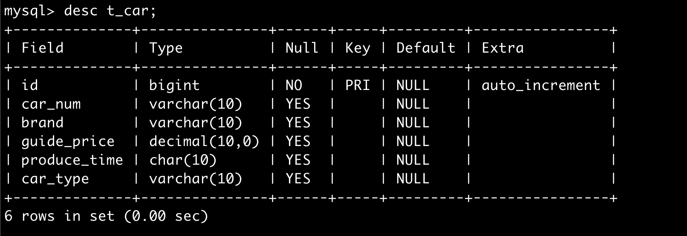
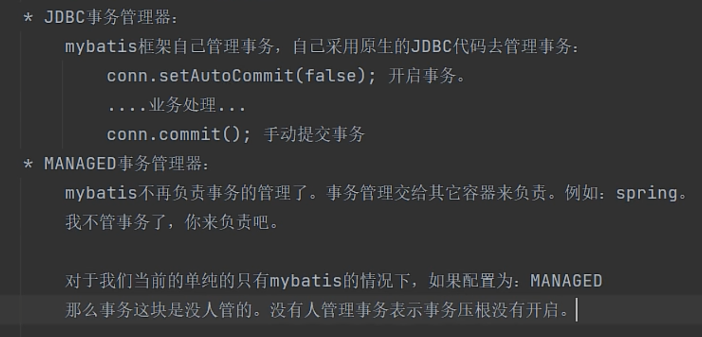

> 版本 3.5.10

# 概念

- 什么是 ORM 框架 ？
  - O(object) java 对象
  - R(Relational) 关系型数据库
  - M(Mapping) 映射
  <hr/>


<p style="color: red">
Mybatis是一个半自动化的ORM框架因为sql还是要自己手写</p>

# 起步

- 创建第一个 mybatis 入门项目
  - 具体步骤
    - 创建 maven 工程
    - 引入依赖
    - 创建 sql 表用于测试
    - 创建 mybatis xml 配置文件
    - 编写代码

## 引入依赖

```xml
<dependencies>
       <dependency>
           <groupId>org.mybatis</groupId>
           <artifactId>mybatis</artifactId>
           <version>3.5.10</version>
       </dependency>

       <dependency>
           <groupId>mysql</groupId>
           <artifactId>mysql-connector-java</artifactId>
           <version>8.0.30</version>
       </dependency>
   </dependencies>

```

## 创建 sql 表用于测试



## 创建 mybatis-config.xml 等配置文件

> 官方配置文件模版

<p>mybatis-config.xml</p>

```xml
<?xml version="1.0" encoding="UTF-8" ?>
<!DOCTYPE configuration
  PUBLIC "-//mybatis.org//DTD Config 3.0//EN"
  "https://mybatis.org/dtd/mybatis-3-config.dtd">
<configuration>
  <environments default="development">
    <environment id="development">
      <transactionManager type="JDBC"/>
      <dataSource type="POOLED">
        <property name="driver" value="${driver}"/>
        <property name="url" value="${url}"/>
        <property name="username" value="${username}"/>
        <property name="password" value="${password}"/>
      </dataSource>
    </environment>
  </environments>
  <mappers>
    <mapper resource="carMapper.xml"/>
  </mappers>
</configuration>
```

<p>carMapper.xml</p>

```xml
<?xml version="1.0" encoding="UTF-8" ?>
<!DOCTYPE mapper
        PUBLIC "-//mybatis.org//DTD Mapper 3.0//EN"
        "https://mybatis.org/dtd/mybatis-3-mapper.dtd">

<mapper namespace="">
    <insert id="insertCar">
        insert into t_car (id ,car_num,brand,guide_price,produce_time,car_type) values (null,'10','京A12345',1000000, '2020-01-01','宝马')
    </insert>
</mapper>

```

## 编写第一个 mybatis 程序 插入数据

```java
package com.yili;

import org.apache.ibatis.io.Resources;
import org.apache.ibatis.session.SqlSession;
import org.apache.ibatis.session.SqlSessionFactory;
import org.apache.ibatis.session.SqlSessionFactoryBuilder;

import java.io.InputStream;

public class Main {
    public static void main(String[] args) throws Exception {
        //mybatis创建sqlSession对象执行sql insert语句的过程

        //1.创建sqlSessionFactoryBuilder 引用mybatis的配置文件创建sqlSessionFactory
        SqlSessionFactoryBuilder sqlSessionFactoryBuilder =new SqlSessionFactoryBuilder();

        //2.sqlSessionFactoryBuilder的build的方法 返回 SqlSessionFactory
        InputStream stream = Resources.getResourceAsStream("mybatis-config.xml");
        SqlSessionFactory sqlSessionFactory = sqlSessionFactoryBuilder.build(stream);

        //3.获取SqlSession  参数autoCommit 布尔值为true 事务自动提交
        SqlSession sqlSession = sqlSessionFactory.openSession();

        //4.sqlSession.insert(XXXmapper.xml文件中insert标签的id)
        int count = sqlSession.insert("insertCar");
        System.out.printf("插入%d条记录",count);

        //5.提交事务
        sqlSession.commit();
    }
}


```

## 项目结构

```bash
├── main
│   ├── java
│   │   └── com
│   │       └── yili
│   │           └── Main.java
│   └── resources
│       ├── CarMapper.xml
│       └── mybatis-config.xml
└── test
    └── java
```

## 关于 mybatis 事务管理器

- 在 mybatis-config.xml 的标签

```xml
<transactionManager type="JDBC"/>
```



## 关于 mybatis 日志

- 在 mybatis-config.xml 的标签

```xml
<!-- 必须放到最上面 <configuration> 之后-->
    <settings>
        <setting name="logImpl" value="STDOUT_LOGGING"/>
    </settings>
```

### 集成第三方日志

- SLFJ

```xml
<dependency>
   <groupId>ch.qos.logback</groupId>
   <artifactId>logback-classic</artifactId>
   <version>1.2.11</version>
   <scope>test</scope>
</dependency>

```

logback 的配置文件

```xml
<?xml version="1.0" encoding="UTF-8"?>

<!-- 配置文件修改时重新加载，默认true -->
<configuration debug="false">

    <!-- 控制台输出 -->
    <appender name="STDOUT" class="ch.qos.logback.core.ConsoleAppender">
        <encoder class="ch.qos.logback.classic.encoder.PatternLayoutEncoder" charset="UTF-8">
            <!-- 输出日志记录格式 -->
            <pattern>[%thread] %-5level %logger{50} - %msg%n</pattern>
        </encoder>
    </appender>

    <!--    mybatis log configure-->
    <logger name="com.apache.ibatis" level="TRACE"/>
    <logger name="java.sql.Connection" level="DEBUG"/>
    <logger name="java.sql.Statement" level="DEBUG"/>
    <logger name="java.sql.PreparedStatement" level="DEBUG"/>


    <!-- 日志输出级别,LOGBACK日志级别包括五个：TRACE < DEBUG < INFO < WARN < ERROR-->
    <root level="DEBUG">
        <appender-ref ref="STDOUT"/>
        <appender-ref ref="FILE"/>
    </root>
</configuration>


```

## 封装一个 SqlSessionUtil

```java
package com.yili.utils;

import org.apache.ibatis.io.Resources;
import org.apache.ibatis.session.SqlSession;
import org.apache.ibatis.session.SqlSessionFactory;
import org.apache.ibatis.session.SqlSessionFactoryBuilder;

public class SqlSessionUtil {
  private SqlSessionUtil() {}
  private static SqlSessionFactory sqlSessionFactory;
  static {
      try {
          SqlSessionFactoryBuilder sqlSessionFactoryBuilder = new SqlSessionFactoryBuilder();
          sqlSessionFactory = sqlSessionFactoryBuilder.build(Resources.getResourceAsStream("mybatis-config.xml"));
      }catch (Exception e){
          e.printStackTrace();
      }
  }
    public static SqlSession build() {
        return sqlSessionFactory.openSession();
    }
}


```

## 测试 crud 操作

删除和更新先省略

```java
package com.yili;

import com.yili.entity.Car;
import com.yili.utils.SqlSessionUtil;
import org.apache.ibatis.session.SqlSession;
import org.junit.Test;

import java.util.HashMap;
import java.util.List;
import java.util.Map;

public class MainTest {

    @Test
    public void testInsertCarByMap() {
        SqlSession build = SqlSessionUtil.build();
        Map<String,Object>map =new HashMap<String, Object>();
        map.put("car_num",10);
        map.put("brand","宝马");
        map.put("guide_price",10000);
        map.put("produce_time","2011-11-5");
        map.put("car_type","混动");
        int insert = build.insert("insertCarByMap",map);
        build.commit();
        build.close();
    }

    @Test
    public void testInsertCarByEntity() {
        SqlSession build = SqlSessionUtil.build();
        Car car =new Car( null,"10","宝马",10000,"2011-11-5","混动");
        int insert = build.insert("insertCarByEntity",car);
        build.commit();
        build.close();
    }

    @Test
    public void testSelectCarById() {
        SqlSession build = SqlSessionUtil.build();
        Car car = build.selectOne("selectCarById", 1);
        System.out.println(car);
        build.commit();
        build.close();
    }


    @Test
    public void testSelectALl() {
        SqlSession build = SqlSessionUtil.build();
        List<Object> cars = build.selectList("selectAll");
        System.out.println(cars);
        build.commit();
        build.close();
    }
}

```

CarMappr.xml

```xml
<?xml version="1.0" encoding="UTF-8" ?>
<!DOCTYPE mapper
        PUBLIC "-//mybatis.org//DTD Mapper 3.0//EN"
        "https://mybatis.org/dtd/mybatis-3-mapper.dtd">

<mapper namespace="org.mybatis.example.BlogMapper">

    <insert id="insertCarByMap">
        insert into t_car (id ,car_num,brand,guide_price,produce_time,car_type)
        values (null,#{car_num},#{brand},#{guide_price},#{produce_time},#{car_type})
    </insert>

    <insert id="insertCarByEntity">
        insert into t_car (id ,car_num,brand,guide_price,produce_time,car_type)
        values (null,#{carNum},#{brand},#{guidePrice},#{produceTime},#{carType})
    </insert>

    <select id="selectCarById" resultType="com.yili.entity.Car">
        select * from t_car where id = #{id}
    </select>


    <select id="selectAll" resultType="com.yili.entity.Car">
        select * from t_car
    </select>

</mapper>

```

### 关于 namespace 标签

当两个 XXXmapper.xml 中要执行的标签的 id 重复的时候<br>
需要在执行操作的时候用如下写法

```java
//aaa 就是XXXMapper.xml 文件的namespace标签的value
//用来做mapper.xml 的唯一标识
Car car = build.selectOne("aaa.selectCarById", 1);

```
