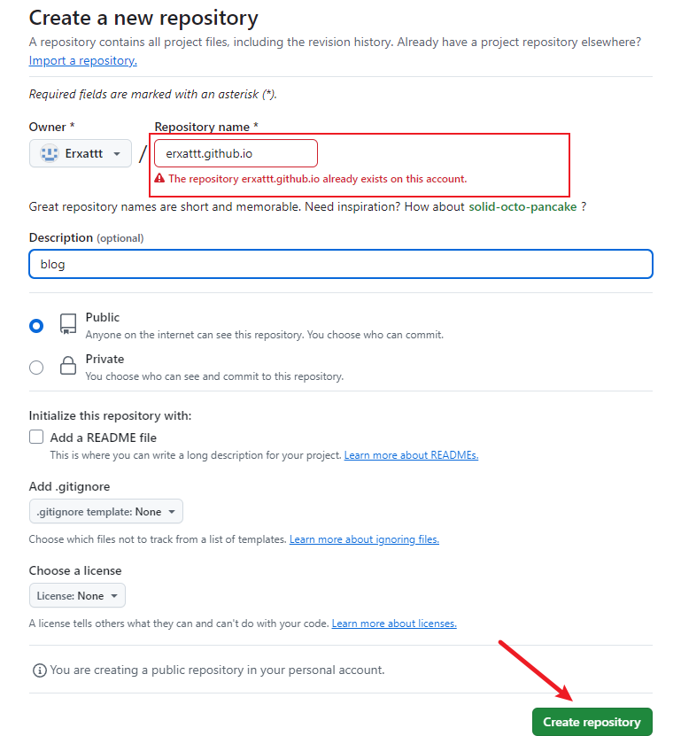
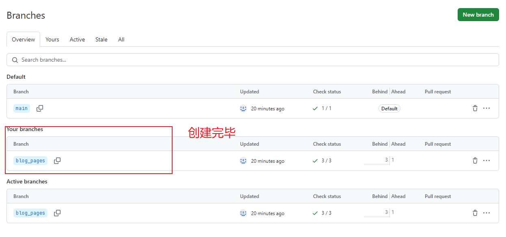
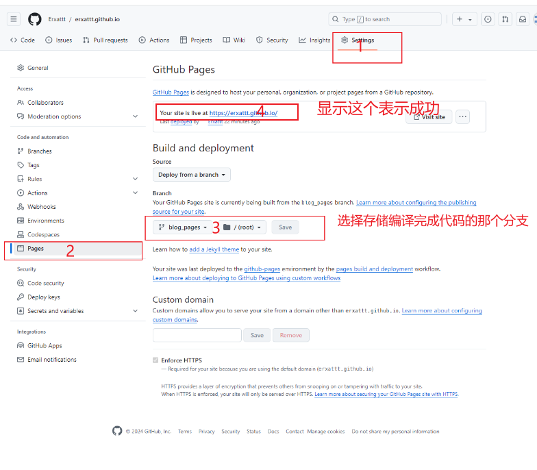
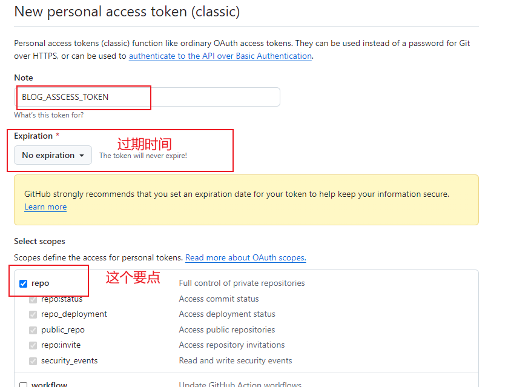
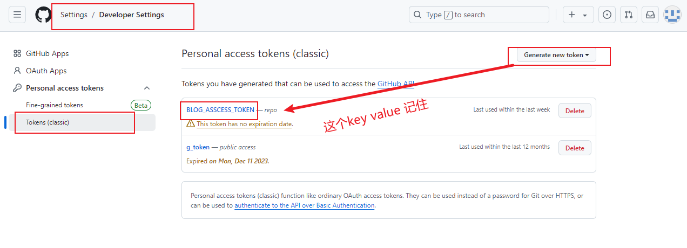
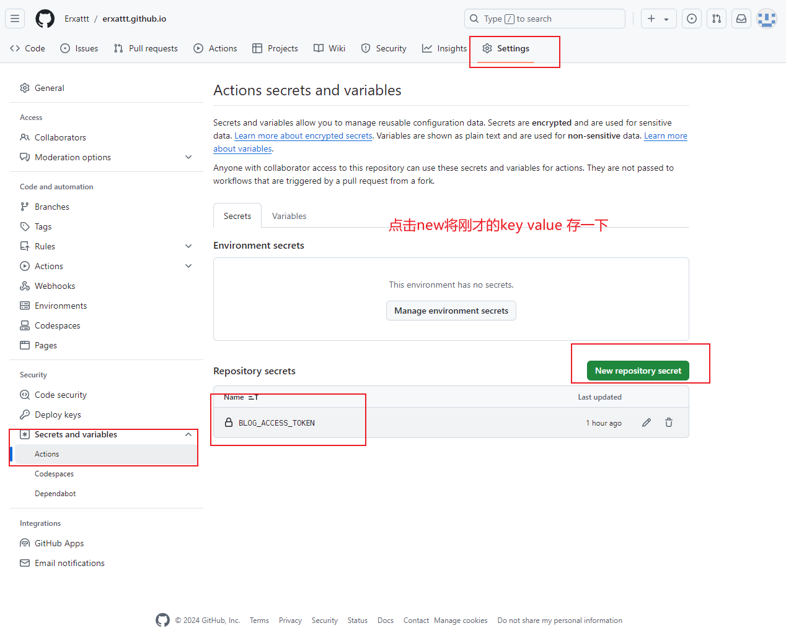

## github配置

### 创建github仓库



### 创建一个分支存储编译完成的代码



### 设置静态页面对应的分支



### 生成accesstoken



点击生成是上面的步骤



将token绑定到创建的仓库里



至此github的配置完毕

## 本地配置

### 创建vuepress的博客示例

关于如何创建请访问[vuepress官网](https://vuepress.vuejs.org/guide/getting-started.html)

### git绑定远程仓库

1. 将vuepress项目绑定到远程仓库

2. 修改项目中.github/workflows/下的deploy.yaml（名字可能不一样）文件，需要修改的是两个重要的属性，其他的不要变。

   - 第一个是`GITHUB_TOKEN`填前面设置的key

   - 第二个是`target_branch`写前面设置的静态的那个分支

   ```YAML
   name: deploy
   
   on:
     # 每当 push 到 main 分支时触发部署
     # Deployment is triggered whenever a push is made to the main branch.
     push:
       branches: [main]
     # 手动触发部署
     # Manually trigger deployment
     workflow_dispatch:
   
   jobs:
     docs:
       runs-on: ubuntu-latest
   
       steps:
         - uses: actions/checkout@v4
           with:
             # “最近更新时间” 等 git 日志相关信息，需要拉取全部提交记录
             # "Last updated time" and other git log-related information require fetching all commit records.
             fetch-depth: 0
   
         - name: Setup Node.js
           uses: actions/setup-node@v4
           with:
             # 选择要使用的 node 版本
             node-version: 20
   
         # 安装依赖
         # Install dependencies
         - name: Install Dependencies
           run: npm ci
   
         # 运行构建脚本
         # Run the build script
         - name: Build VuePress site
           run: npm run docs:build
   
         # 查看 workflow 的文档来获取更多信息
         # @see https://github.com/crazy-max/ghaction-github-pages
         - name: Deploy to GitHub Pages
           uses: crazy-max/ghaction-github-pages@v4
           with:
             # 部署到 gh-pages 分支
             target_branch: blog_pages
             # 部署目录为 VuePress 的默认输出目录
             build_dir: docs/.vuepress/dist
           env:
             # @see https://docs.github.com/cn/actions/reference/authentication-in-a-workflow#about-the-github_token-secret
             GITHUB_TOKEN: ${{ secrets.BLOG_ACCESS_TOKEN }}
   
   ```

   3. 打包vuepress注意需要打包到上面`build_dir`的位置
   4. 最后提交代码，发布到远程main分支去不是静态分支
   5. 看一下远程仓库的Actions是否成功
   6. 部署完毕

